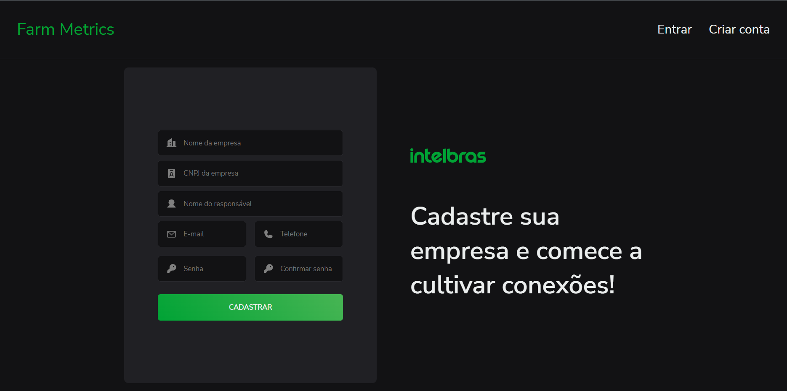
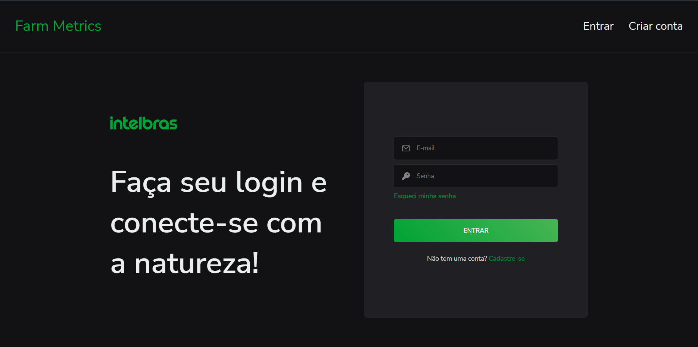
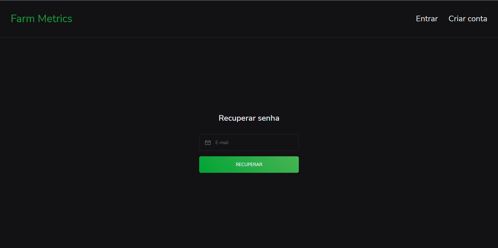
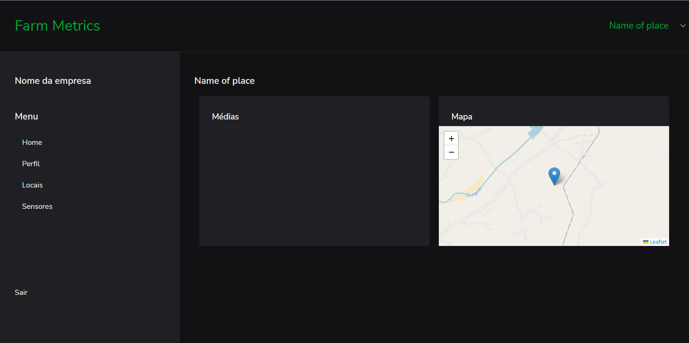
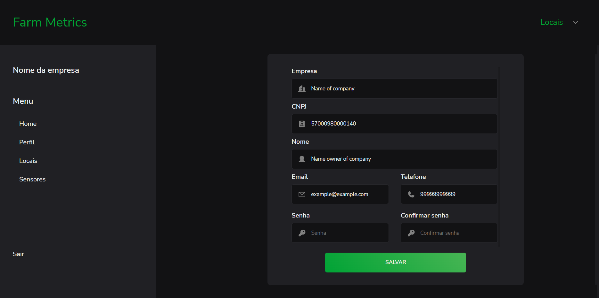
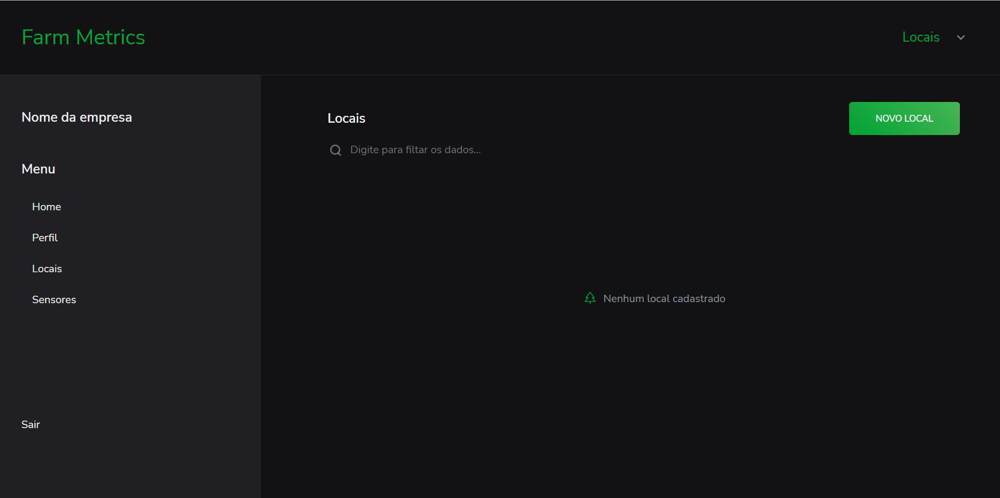
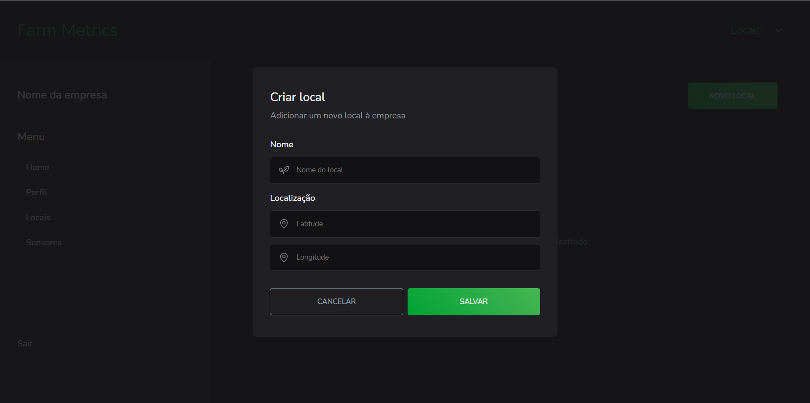
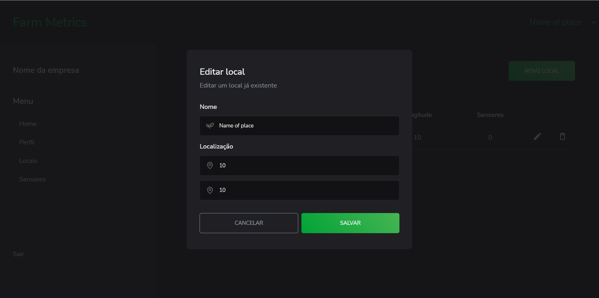
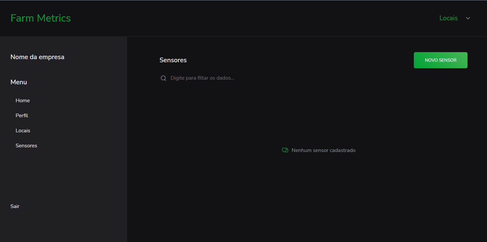
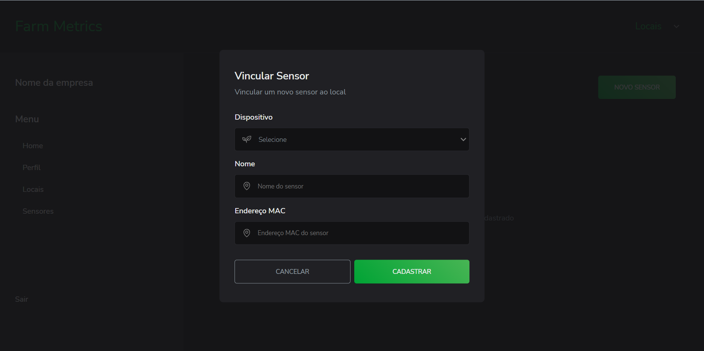

# M3P2-FrontEnd-Squad1 - Projeto Avaliativo 2 - Connect Lab Plus FrontEnd


## Link da Apresentação

[Apresentação](https://docs.google.com/presentation/d/10ImTKQP3bEXzey7sIvqKbKgau3lLibvx/edit?usp=share_link&ouid=117801574216764995635&rtpof=true&sd=true)

## Link Trello

[Trello](https://trello.com/b/uj6w0AO7/m3p2-frontend-squad-1)

## Link Repositorio

[GitHub](https://github.com/DEVin-Intelbras/M3P2-FrontEnd-Squad1)

## Link de acesso

http://{SEU IP}:{PORTA PROJETO}

\*\*\*Obs.: por padrão este projeto esta na porta 3001

## Descrição

Solução backend desenvolvida para funcionar em conjunto com solução FrontEnd com o mesmo nome. Este projeto tem por finalidade ser o projeto final do 3° módulo do curso DevInHouse - Turma Intelbrás.
Este projeto foi elaborado em uma squad de 5 integrantes, onde os mesmos realizaram todo o planejamento e execução das atividades, conforme padrões e boas práticas adotadas pela comunidade Dev.

## Solução Desenvolvida

É uma plataforma de gerenciamento remoto que permite monitorar e controlar dispositivos conectados à internet em um determinado local. Esse sistema é capaz de coletar dados de sensores e outros dispositivos, processá-los e fornecer informações úteis para o usuário.

## Funções

- [x] Login
- [x] Cadastro de novos usuarios
- [x] Cadastro e vinculo de dispositivos
- [x] Detalhes de dispositivos
- [x] Listagem de dispositivos
- [x] Cadastro, edição e exclusão de lugares
- [x] Listagem de locais
- [x] Edição de locais

## Pré-requisitos

Para o uso desta ferramenta, serão necessarias as ferramentas abaixo:

- Node.Js
- Git
- Connect Lab Plus BackEnd [link-git](https://github.com/DEVin-Intelbras/M3P2-BackEnd-Squad1)

## Instalação

```bash
git clone https://github.com/DEVin-Intelbras/M3P2-FrontEnd-Squad1.git
```

```bash
cd M3P2-FrontEnd-Squad1
```

```bash
npm install
```

## Executando aplicação

### Iniciando aplicação

```bash
# Modo Desenvolvedor
$ npm run dev

# Modo Compilação
$ npm run build
```

## Mantenha Contato

- [Anderson Silva Tome](https://github.com/RDX777)
- [Diego Wendt Rodrigues](https://github.com/diego-wendt)
- [Karla Ciesielski Vida](https://github.com/karla-vida)
- [Matheus Adriano Martins](https://github.com/Halkner)
- [Tomás Borges De Almeida Cunha](https://github.com/tomas-cunha)

## Telas

- Cadastro



- Login



- Esqueceu Senha



- Home



- Perfil



- Locais



- Cadastro de novos locais



- Editar local



- Sensor



- Cadastro de novos sensores



### Tecnologias utilizadas

- [React](https://legacy.reactjs.org/docs/getting-started.html)
- [Material-UI](https://mui.com)
- [Axios](https://axios-http.com/docs/intro)
- [React-Toastify](https://fkhadra.github.io/react-toastify/introduction)
- [Zod](https://zod.dev)
- [ApexCharts](https://apexcharts.com/docs/)
- [Javascript](https://developer.mozilla.org/pt-BR/docs/Web/JavaScript)
- [TypeScript](https://www.typescriptlang.org)

## Licença

MIT License
